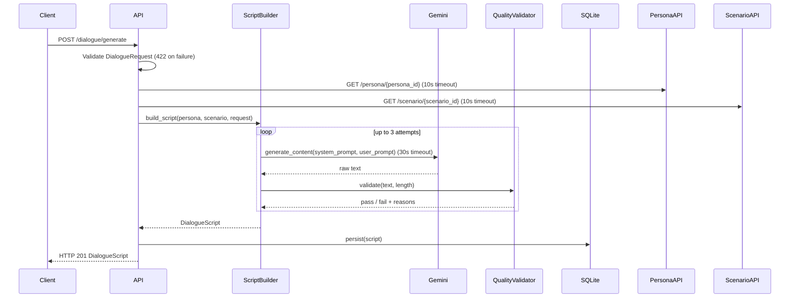

# Design Document: Dialogue Generator

## Overview

The Dialogue Generator is a FastAPI microservice that produces voice-ready spoken monologues ("DialogueScripts") from a user's future-self persona and a chosen scenario. It sits between the upstream Persona Generator and Scenario Engine modules and the downstream Audio Production Engine.

A request arrives with a `persona_id`, `scenario_id`, requested `length`, and an optional `tone_override`. The service fetches the Persona and Scenario records from their respective upstream APIs, constructs a two-part LLM prompt, calls Google Gemini, parses and validates the response, persists the result to SQLite, and returns the `DialogueScript` to the caller.

Every generated script must:
- Follow a mandatory four-part narrative arc: opening hook → reflection → advice/warning → closing line
- Be written in first-person, natural spoken language
- Contain inline emotional markers (`[pause]`, `[softer]`, `[warmth]`, `[urgency]`, `[breath]`, `[slower]`, `[faster]`)
- Target 25–35 seconds (`"short"`) or 50–65 seconds (`"long"`) of spoken delivery at 130 wpm

A React `ScriptEditor` component provides the browser-based interface for viewing, editing, and regenerating scripts.

---

## Architecture

```mermaid
graph TD
    Client["React ScriptEditor"] -->|POST /dialogue/generate\nPOST /dialogue/regenerate\nGET /dialogue/{id}| API["DialogueGenerator_API\n(FastAPI)"]

    API -->|GET /persona/{id}| PersonaAPI["PersonaGenerator_API"]
    API -->|GET /scenario/{id}| ScenarioAPI["ScenarioEngine_API"]

    API --> SB["ScriptBuilder\n(service layer)"]
    SB -->|generate_content()| Gemini["Google Gemini\n(gemini-1.5-flash / pro)"]
    SB --> Validator["QualityValidator"]

    API --> Store["ScriptStore\n(SQLite)"]

    subgraph "Dialogue Generator Service"
        API
        SB
        Validator
        Store
    end
```

### Request Lifecycle



---

## Components and Interfaces

### 1. DialogueGenerator_API (FastAPI application)

The top-level FastAPI app. Owns routing, request validation, upstream resolution, error handling, and persistence orchestration.

```python
# app/main.py
from fastapi import FastAPI
app = FastAPI(title="Dialogue Generator")

# Routes
POST /dialogue/generate    -> generate_dialogue(request: DialogueRequest) -> DialogueScript
POST /dialogue/regenerate  -> regenerate_dialogue(request: DialogueRequest) -> DialogueScript
GET  /dialogue/{script_id} -> get_dialogue(script_id: str) -> DialogueScript
```

**Responsibilities:**
- Validate `DialogueRequest` via Pydantic (HTTP 422 on failure)
- Fetch Persona and Scenario from upstream APIs with 10-second timeouts
- Delegate to `ScriptBuilder` for LLM generation
- Persist the resulting `DialogueScript` to `ScriptStore`
- Return structured JSON error responses for all 4xx/5xx cases

### 2. ScriptBuilder (service layer)

Pure service class — no FastAPI dependency. Owns prompt construction, Gemini invocation, response parsing, emotional marker extraction, duration estimation, and the quality retry loop.

```python
# app/services/script_builder.py
class ScriptBuilder:
    def __init__(self, gemini_client: GeminiClient, config: ScriptBuilderConfig): ...

    async def build_script(
        self,
        persona: Persona,
        scenario: Scenario,
        length: str,
        tone_override: str | None,
    ) -> DialogueScript: ...

    def _build_system_prompt(self, persona: Persona, scenario: Scenario, tone: str) -> str: ...
    def _build_user_prompt(self, persona: Persona, scenario: Scenario, length: str) -> str: ...
    def _parse_response(self, raw_text: str) -> tuple[str, list[str]]: ...
    def _estimate_duration(self, text: str) -> float: ...
    def _strip_invalid_markers(self, text: str) -> str: ...
    def _extract_markers(self, text: str) -> list[str]: ...
```

### 3. GeminiClient (LLM adapter)

Thin wrapper around `google-generativeai`. Isolates the SDK dependency so the provider can be swapped.

```python
# app/clients/gemini_client.py
class GeminiClient:
    def __init__(self, model_name: str, api_key: str, timeout_sec: int = 30): ...

    async def generate(self, system_prompt: str, user_prompt: str) -> str: ...
```

The client uses `genai.GenerativeModel` with a `generation_config` that sets `temperature=0.85` and `max_output_tokens=512` for short, `1024` for long scripts. The 30-second timeout is enforced via `asyncio.wait_for`.

### 4. QualityValidator

Stateless validator that checks a generated script against the three quality gates.

```python
# app/services/quality_validator.py
@dataclass
class ValidationResult:
    passed: bool
    structure_ok: bool
    duration_ok: bool
    markers_ok: bool
    failure_reasons: list[str]

class QualityValidator:
    def validate(self, text: str, estimated_duration_sec: float, length: str) -> ValidationResult: ...
    def _check_structure(self, text: str) -> bool: ...
    def _check_duration(self, duration: float, length: str) -> bool: ...
    def _check_markers(self, text: str) -> bool: ...
```

Structure detection uses heuristic keyword/phrase matching against the four expected sections (see Prompt Strategy below for how the LLM is instructed to label them).

### 5. ScriptStore (SQLite persistence)

```python
# app/store/script_store.py
class ScriptStore:
    async def save(self, script: PersistedScript) -> None: ...
    async def get(self, script_id: str) -> PersistedScript | None: ...
```

Uses `aiosqlite` for async access. A single `scripts` table stores all fields.

### 6. UpstreamClient (HTTP resolver)

```python
# app/clients/upstream_client.py
class UpstreamClient:
    async def get_persona(self, persona_id: str) -> Persona: ...
    async def get_scenario(self, scenario_id: str) -> Scenario: ...
```

Uses `httpx.AsyncClient` with a 10-second timeout. Raises typed exceptions (`PersonaNotFoundError`, `ScenarioNotFoundError`, `UpstreamServiceError`, `UpstreamTimeoutError`) that the API layer maps to HTTP status codes.

---

## Data Models

### API Models (Pydantic)

```python
# app/models/api.py
from pydantic import BaseModel, Field, field_validator
from typing import Literal

class DialogueRequest(BaseModel):
    persona_id: str
    scenario_id: str
    length: Literal["short", "long"]
    tone_override: str | None = Field(default=None, max_length=100)

    @field_validator("persona_id", "scenario_id")
    @classmethod
    def no_whitespace(cls, v: str) -> str:
        if not v or v != v.strip() or " " in v:
            raise ValueError("must be a non-empty string with no whitespace")
        return v

    @field_validator("tone_override")
    @classmethod
    def tone_not_empty(cls, v: str | None) -> str | None:
        if v is not None and not v.strip():
            raise ValueError("tone_override must not be blank if provided")
        return v


class DialogueScript(BaseModel):
    script_id: str                    # UUID4 string
    text: str                         # full script with inline markers
    estimated_duration_sec: float
    emotional_markers: list[str]      # unique marker tokens present in text


class ErrorResponse(BaseModel):
    detail: str
```

### Upstream Models (Pydantic)

```python
# app/models/upstream.py
class Persona(BaseModel):
    persona_id: str
    summary: str
    tone: str                         # "warm" | "urgent" | "reflective" | ...
    key_life_events: list[str]
    life_outcome: str
    key_message: str
    scenario_type: str                # "success" | "regret" | "neutral"


class Scenario(BaseModel):
    scenario_id: str
    title: str
    context: str
    emotional_target: str
    trigger: str
```

### Persistence Model

```python
# app/models/persistence.py
from datetime import datetime

class PersistedScript(BaseModel):
    script_id: str
    text: str
    estimated_duration_sec: float
    emotional_markers: list[str]      # stored as JSON array string in SQLite
    persona_id: str
    scenario_id: str
    length: str
    created_at: datetime              # UTC ISO 8601
    quality_pass: bool
    quality_detail: str               # JSON: {"structure_ok": true, ...}
```

### SQLite Schema

```sql
CREATE TABLE IF NOT EXISTS scripts (
    script_id           TEXT PRIMARY KEY,
    text                TEXT NOT NULL,
    estimated_duration_sec REAL NOT NULL,
    emotional_markers   TEXT NOT NULL,   -- JSON array
    persona_id          TEXT NOT NULL,
    scenario_id         TEXT NOT NULL,
    length              TEXT NOT NULL,
    created_at          TEXT NOT NULL,   -- ISO 8601 UTC
    quality_pass        INTEGER NOT NULL, -- 0 or 1
    quality_detail      TEXT NOT NULL    -- JSON object
);
```

---

## Gemini Prompt Strategy

### System Prompt Template

The system prompt establishes the voice, persona, and situational context. It is constructed once per request and passed as the `system_instruction` parameter to `GenerativeModel`.

```
You are {persona_summary}.

Your tone is {tone}. You are speaking directly to your younger self — the person you used to be.

Your life journey: {key_life_events_bullet_list}

The scenario type is "{scenario_type}":
- "success" → speak with confidence and quiet fulfillment
- "regret"  → speak with reflective weight and gentle honesty
- "neutral" → speak with calm, observational clarity

The situation your younger self is facing: {scenario_context}
The emotional register to aim for: {scenario_emotional_target}
```

### User Prompt Template

The user prompt requests the specific script with structural and marker instructions.

```
Write a spoken monologue from your future self to your present self.

STRUCTURE — you MUST include exactly these four labeled sections in order:
[HOOK] An opening line that immediately grabs attention, anchored to: "{scenario_trigger}"
[REFLECTION] A reflection on the journey, referencing this milestone: "{key_life_event}"
[ADVICE] Advice or a warning relevant to the present moment
[CLOSING] A closing line that delivers this core message: "{key_message}"

LENGTH: Target {word_target} words (~{target_seconds} seconds at 130 wpm).

EMOTIONAL MARKERS: Embed these inline markers where appropriate: [pause], [softer], [warmth], [urgency], [breath], [slower], [faster].
{tone_marker_guidance}
Use the scenario's emotional target ("{emotional_target}") to guide marker selection.
You MUST include at least one marker.

STYLE: First-person, natural spoken language. Use contractions. No formal prose. No stage directions outside square-bracket markers. No meta-commentary.

Output ONLY the script text. Do not include section labels like [HOOK] in the final output.
```

**Tone marker guidance** is injected based on `Persona.tone`:
- `"warm"` → `Prefer [warmth] markers.`
- `"urgent"` → `Prefer [urgency] markers.`
- `"reflective"` → `Prefer [slower] and [pause] markers.`

**Word targets by length:**
| Length | Word target | Target seconds |
|--------|-------------|----------------|
| short  | 65–75 words | 30s            |
| long   | 110–130 words | 60s          |

### Section Label Strategy for Structure Validation

The user prompt instructs the LLM to use `[HOOK]`, `[REFLECTION]`, `[ADVICE]`, `[CLOSING]` labels internally during generation but to strip them from the final output. The `QualityValidator._check_structure` method uses a secondary heuristic: it checks that the script contains at least 4 sentence-level segments and that the first sentence is interrogative or declarative-imperative (hook pattern), and that the last sentence is short (≤ 20 words, closing pattern). If the LLM does not strip the labels, the parser strips them before storing.

---

## Emotional Marker Extraction Logic

```python
import re

VALID_MARKERS = {"pause", "softer", "warmth", "urgency", "breath", "slower", "faster"}
MARKER_PATTERN = re.compile(r'\[([a-z]+)\]', re.IGNORECASE)

def _strip_invalid_markers(self, text: str) -> str:
    """Remove any marker tokens not in VALID_MARKERS."""
    def replace(m):
        token = m.group(1).lower()
        return m.group(0) if token in VALID_MARKERS else ""
    return MARKER_PATTERN.sub(replace, text)

def _extract_markers(self, text: str) -> list[str]:
    """Return sorted list of unique valid marker tokens found in text."""
    found = {m.group(1).lower() for m in MARKER_PATTERN.finditer(text)}
    return sorted(found & VALID_MARKERS)
```

Processing order:
1. Receive raw LLM text
2. Strip structural labels (`[HOOK]`, `[REFLECTION]`, `[ADVICE]`, `[CLOSING]`) if present
3. Strip invalid marker tokens via `_strip_invalid_markers`
4. Extract unique valid markers via `_extract_markers`
5. Estimate duration on the cleaned text

---

## Duration Estimation

```python
WORDS_PER_MINUTE = 130.0

def _estimate_duration(self, text: str) -> float:
    """Estimate spoken duration in seconds from word count at 130 wpm."""
    # Strip marker tokens before counting — they are not spoken
    clean = MARKER_PATTERN.sub("", text)
    word_count = len(clean.split())
    return round((word_count / WORDS_PER_MINUTE) * 60, 1)
```

Duration target ranges:
| Length | Min (sec) | Max (sec) |
|--------|-----------|-----------|
| short  | 25        | 35        |
| long   | 50        | 65        |

---

## Quality Validation Loop

```python
MAX_RETRIES = 2

async def build_script(self, persona, scenario, length, tone_override) -> DialogueScript:
    tone = tone_override or persona.tone
    system_prompt = self._build_system_prompt(persona, scenario, tone)
    user_prompt = self._build_user_prompt(persona, scenario, length)

    last_result = None
    for attempt in range(MAX_RETRIES + 1):
        raw = await self.gemini_client.generate(system_prompt, user_prompt)
        text = self._strip_labels(raw)
        text = self._strip_invalid_markers(text)
        markers = self._extract_markers(text)
        duration = self._estimate_duration(text)

        result = self.validator.validate(text, duration, length)
        if result.passed:
            return DialogueScript(
                script_id=str(uuid.uuid4()),
                text=text,
                estimated_duration_sec=duration,
                emotional_markers=markers,
            )

        logger.warning(
            "Quality check failed (attempt %d/%d): %s",
            attempt + 1, MAX_RETRIES + 1, result.failure_reasons
        )
        last_result = result

    raise ScriptQualityError(f"Script failed quality checks after {MAX_RETRIES + 1} attempts: {last_result.failure_reasons}")
```

The API layer catches `ScriptQualityError` and returns HTTP 502.

---

## Error Handling

### Exception Hierarchy

```python
# app/exceptions.py
class DialogueGeneratorError(Exception): ...

class UpstreamError(DialogueGeneratorError): ...
class PersonaNotFoundError(UpstreamError): ...       # → HTTP 404
class ScenarioNotFoundError(UpstreamError): ...      # → HTTP 404
class UpstreamServiceError(UpstreamError): ...       # → HTTP 502
class UpstreamTimeoutError(UpstreamError): ...       # → HTTP 504

class LLMError(DialogueGeneratorError): ...
class LLMTimeoutError(LLMError): ...                 # → HTTP 504
class LLMProviderError(LLMError): ...                # → HTTP 502
class ScriptQualityError(LLMError): ...              # → HTTP 502

class StoreError(DialogueGeneratorError): ...        # → HTTP 503
```

### HTTP Status Code Mapping

| Condition | HTTP Status |
|-----------|-------------|
| Invalid request fields | 422 |
| `persona_id` not found | 404 |
| `scenario_id` not found | 404 |
| `script_id` not found (GET) | 404 |
| Upstream API 5xx | 502 |
| Upstream API timeout | 504 |
| Gemini timeout | 504 |
| Gemini error / quality failure | 502 |
| SQLite unavailable | 503 |
| Unhandled exception | 500 |

### FastAPI Exception Handlers

```python
@app.exception_handler(PersonaNotFoundError)
async def persona_not_found(request, exc):
    log_error(request, exc)
    return JSONResponse(status_code=404, content={"detail": str(exc)})

# ... similar handlers for each exception type

@app.exception_handler(Exception)
async def unhandled(request, exc):
    logger.exception("Unhandled exception on %s %s", request.method, request.url.path)
    return JSONResponse(status_code=500, content={"detail": "Internal server error"})
```

All handlers log: timestamp, request path, HTTP method, error detail. Stack traces are logged server-side only and never returned to the client.

---

## React ScriptEditor Component

### Component Structure

```
ScriptEditor/
├── ScriptEditor.tsx          # root component
├── ScriptDisplay.tsx         # renders text with highlighted markers
├── MarkerBadge.tsx           # colored badge for a single marker token
├── DurationDisplay.tsx       # formats estimated_duration_sec → "0m 30s"
├── RegenerateControls.tsx    # length selector + tone_override input + button
└── useScriptEditor.ts        # state + API call logic (custom hook)
```

### State Shape

```typescript
interface ScriptEditorState {
  script: DialogueScript | null;
  personaId: string;
  scenarioId: string;
  length: "short" | "long";
  toneOverride: string;
  isLoading: boolean;
  error: string | null;
}
```

### Marker Highlighting

`ScriptDisplay` splits the script text on the marker regex `\[([a-z]+)\]` and renders each segment as either plain text or a `<MarkerBadge>`. Each valid marker token gets a distinct color:

| Marker | Color |
|--------|-------|
| pause | slate |
| softer | sky |
| warmth | amber |
| urgency | red |
| breath | teal |
| slower | violet |
| faster | orange |

### Real-time Re-parsing (Requirement 10.10)

When the user edits the textarea, an `onChange` handler re-runs the marker extraction regex on the current text and updates the `emotional_markers` display without any network call. This is a pure client-side operation.

```typescript
const handleTextChange = (newText: string) => {
  const markers = extractMarkers(newText); // client-side regex
  setScript(prev => prev ? { ...prev, text: newText, emotional_markers: markers } : null);
};
```

### Regeneration Flow

```typescript
const handleRegenerate = async () => {
  setIsLoading(true);
  setError(null);
  try {
    const result = await fetch("/dialogue/regenerate", {
      method: "POST",
      headers: { "Content-Type": "application/json" },
      body: JSON.stringify({ persona_id, scenario_id, length, tone_override: toneOverride || undefined }),
    });
    if (!result.ok) {
      const err = await result.json();
      setError(errorMessage(result.status, err.detail));
      return;
    }
    setScript(await result.json());
  } finally {
    setIsLoading(false);
  }
};
```

All controls are `disabled={isLoading}` and a spinner is shown while loading.

### Error Message Mapping

| HTTP Status | User-facing message |
|-------------|---------------------|
| 404 | "Persona or scenario not found. Please check your selection." |
| 422 | "Invalid request. Please check your inputs." |
| 502 | "Script generation failed. Please try again." |
| 504 | "The request timed out. Please try again." |
| 500 | "An unexpected error occurred. Please try again." |

---

## Correctness Properties

*A property is a characteristic or behavior that should hold true across all valid executions of a system — essentially, a formal statement about what the system should do. Properties serve as the bridge between human-readable specifications and machine-verifiable correctness guarantees.*

### Property 1: System prompt contains all required persona and scenario fields

*For any* Persona and Scenario object, the system prompt produced by `_build_system_prompt` SHALL contain the persona's `summary`, `tone`, at least one item from `key_life_events`, `scenario_type`, the scenario's `context`, and `emotional_target`.

**Validates: Requirements 1.2, 7.1, 7.4, 7.6, 7.9**

---

### Property 2: Duration estimation formula correctness

*For any* script text, `_estimate_duration` SHALL return a value equal to `round((word_count_of_clean_text / 130.0) * 60, 1)`, where `word_count_of_clean_text` is the word count after all `[marker]` tokens have been removed.

**Validates: Requirements 4.4**

---

### Property 3: Marker extraction returns the correct unique valid set

*For any* text containing an arbitrary mix of valid and invalid marker tokens (possibly repeated), after processing through `_strip_invalid_markers` and `_extract_markers`:
- All invalid marker tokens SHALL be absent from the returned text
- All valid marker tokens present in the original text SHALL be present in the returned text
- The `emotional_markers` list SHALL contain each valid marker token exactly once (no duplicates)

**Validates: Requirements 5.2, 5.3**

---

### Property 4: Tone selection — override takes precedence

*For any* Persona with any `tone` value, and any `tone_override` string:
- WHEN `tone_override` is a non-empty string, the system prompt SHALL contain the `tone_override` value and SHALL NOT contain the Persona's original `tone` value in the tone position
- WHEN `tone_override` is `None`, the system prompt SHALL contain the Persona's `tone` value in the tone position

**Validates: Requirements 6.2, 6.3**

---

### Property 5: Script ID uniqueness across all generated scripts

*For any* collection of N independently generated `DialogueScript` objects (including concurrent requests), all `script_id` values SHALL be distinct non-empty UUID strings containing no whitespace.

**Validates: Requirements 1.6, 1.7, 11.1**

---

### Property 6: Persistence round-trip preserves all fields exactly

*For any* `DialogueScript` that is persisted to the `ScriptStore`, retrieving it by `script_id` SHALL return a record where `text`, `estimated_duration_sec`, `emotional_markers`, `persona_id`, `scenario_id`, and `length` are byte-for-byte identical to the values that were stored.

**Validates: Requirements 8.1, 8.3, 8.5, 11.5, 11.6**

---

### Property 7: ID field validation rejects whitespace and empty strings

*For any* string value supplied as `persona_id` or `scenario_id`:
- WHEN the string is empty, contains leading/trailing whitespace, or contains internal whitespace, validation SHALL reject it and return HTTP 422
- WHEN the string is non-empty and contains no whitespace, validation SHALL accept it

**Validates: Requirements 2.1, 2.2**

---

### Property 8: Length field validation rejects all non-enum values

*For any* string value supplied as `length`:
- WHEN the value is not exactly `"short"` or `"long"`, validation SHALL reject it and return HTTP 422
- WHEN the value is exactly `"short"` or `"long"`, validation SHALL accept it

**Validates: Requirements 2.3, 4.3**

---

## Error Handling

### Structured Error Responses

All error responses follow a consistent JSON shape:

```json
{
  "detail": "Human-readable description of the error"
}
```

Validation errors (HTTP 422) follow FastAPI's default Pydantic error format, which includes per-field `loc`, `msg`, and `type` fields.

### Logging Strategy

Every error log entry includes:
- UTC timestamp
- Request path and HTTP method
- Error detail message
- Exception type

Retry attempts additionally log:
- Attempt number (e.g., `attempt 2/3`)
- LLM provider name
- Failure reason (quality check failures, timeout, provider error)

Upstream call failures additionally log:
- Upstream service name (`PersonaGenerator_API` or `ScenarioEngine_API`)
- HTTP status code returned
- Request URL

Stack traces are written to the server log at `ERROR` level but are never included in client responses.

### Retry Budget

The quality validation retry loop consumes up to 3 total LLM calls (1 initial + 2 retries). Each call has a 30-second timeout. Worst-case latency before returning HTTP 502 is therefore ~90 seconds of LLM time plus upstream resolution time. This is acceptable for an interactive generation flow where the user expects a few seconds of wait time.

---

## Testing Strategy

### Dual Testing Approach

Unit tests cover specific examples, edge cases, and error conditions. Property-based tests verify universal properties across a wide input space. Both are necessary for comprehensive coverage.

### Property-Based Testing Library

**pytest-hypothesis** (Python) is the chosen PBT library. Each property test is configured with `@settings(max_examples=100)`.

Tag format for each property test:
```python
# Feature: dialogue-generator, Property {N}: {property_text}
```

### Property Tests

Each correctness property maps to exactly one property-based test:

| Property | Test file | Hypothesis strategy |
|----------|-----------|---------------------|
| P1: System prompt completeness | `tests/test_script_builder.py` | `st.builds(Persona)`, `st.builds(Scenario)` |
| P2: Duration formula | `tests/test_script_builder.py` | `st.text()` with marker injection |
| P3: Marker extraction | `tests/test_script_builder.py` | `st.text()` with random marker tokens |
| P4: Tone selection | `tests/test_script_builder.py` | `st.builds(Persona)`, `st.text() | st.none()` |
| P5: Script ID uniqueness | `tests/test_api.py` | `st.integers(min_value=2, max_value=50)` for N |
| P6: Persistence round-trip | `tests/test_script_store.py` | `st.builds(PersistedScript)` |
| P7: ID field validation | `tests/test_validation.py` | `st.text()` |
| P8: Length field validation | `tests/test_validation.py` | `st.text()` |

### Unit Tests

Unit tests focus on:
- HTTP 201 response shape for a successful generation (mocked LLM + upstream)
- HTTP 404 when persona not found (mocked upstream returns 404)
- HTTP 404 when scenario not found (mocked upstream returns 404)
- HTTP 502 when upstream returns 5xx
- HTTP 504 when upstream times out
- HTTP 502 when LLM times out
- HTTP 502 when quality checks fail after all retries
- HTTP 503 when SQLite is unavailable
- HTTP 500 for unhandled exceptions (no stack trace in response)
- Retry count: validator fails twice then passes → 3 total LLM calls
- Retry count: no markers twice then valid → 3 total LLM calls
- Quality assessment (`quality_detail`) is persisted in the DB record
- GET `/dialogue/{script_id}` returns 200 with correct body
- GET `/dialogue/{unknown_id}` returns 404

### Integration Tests

- End-to-end: POST `/dialogue/generate` with real SQLite, mocked Gemini and upstream APIs
- Verify correct upstream URLs are called with the correct IDs
- Verify `created_at` is stored in UTC ISO 8601 format

### Frontend Tests (React Testing Library + Vitest)

- `ScriptDisplay` renders marker tokens as colored badges
- `DurationDisplay` formats seconds correctly (e.g., 62.0 → "1m 02s")
- `RegenerateControls` disables all inputs while `isLoading` is true
- `useScriptEditor` re-parses markers on text change without network call
- Error messages map correctly to HTTP status codes
